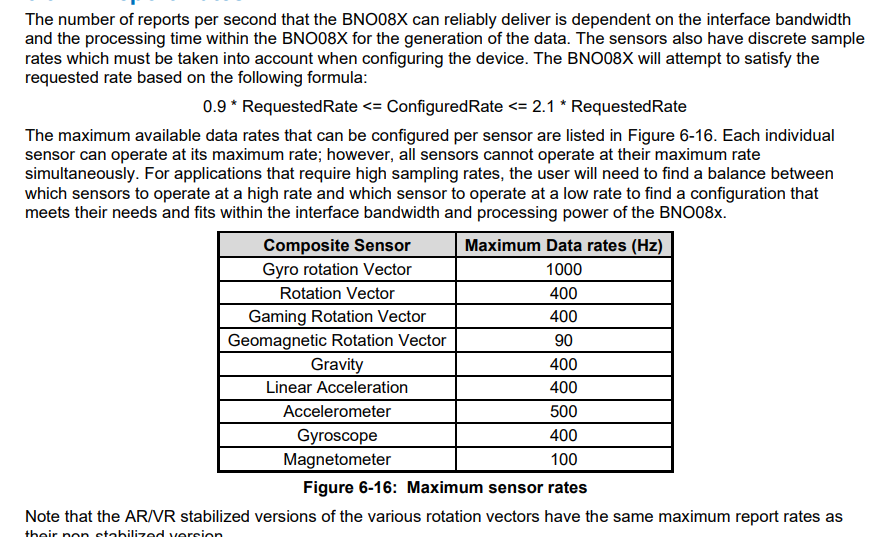
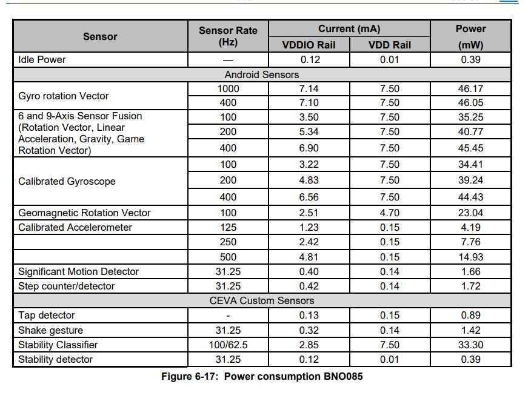
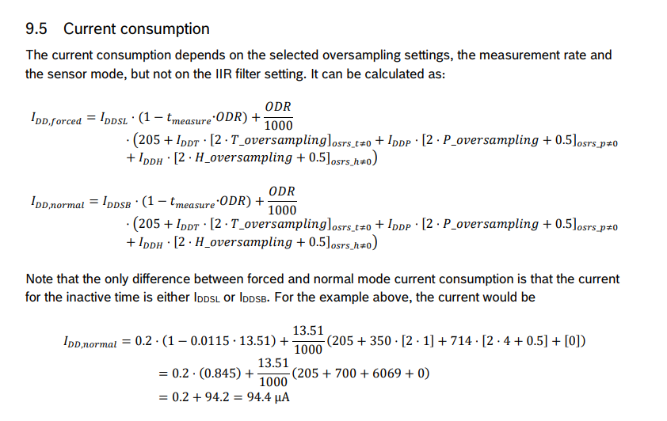

# Chosing a Battery
## requirements
- Run time at least 30min
- Light weight/small size
- Connector type need to match pcb
- Safe

# Chosing a Regualtor
## requirements
- 3.3V output
- Calculated load's maximum current draw (must exceed __mA)

## BNO085 Sensor sampling rate choices

- Linear Acceleration (100Hz)
- Rotation Vector (100Hz)
- Gyrosope (100Hz)
- Accelerometer (100Hz)

Choose the same report rate (100 Hz) for all selected BNO085 outputs to simplify data logging, analysis, and plotting.

The BNO085 chip contains integrated sensor fusion, which internaly calculates the linear acceleration and rotation vectors and outputs those data. This is one of the main factor why I chose this chip.

The current draw depends on sensor sampling rates and enviormental conditions.

## Calculations
Typical Current Estimate:
The BNO085 datasheet provides typical power consumption measurements for representative sensor configurations. The closest configuration to the intended operation is 6/9-axis sensor fusion at 100 Hz: 
VDDIO: 3.5 mA
VDD: 7.5 mA
Since both rails will be supplied by the 3.3 V regulator: I=3.5+7.5=11 mA
This is used as an estimated typical current, rather than an exact value.

A guaranteed maximum operating current for this specific configuration is not provided, so additional design margin will be included when sizing the power supply.
Estimation: 18 mA

