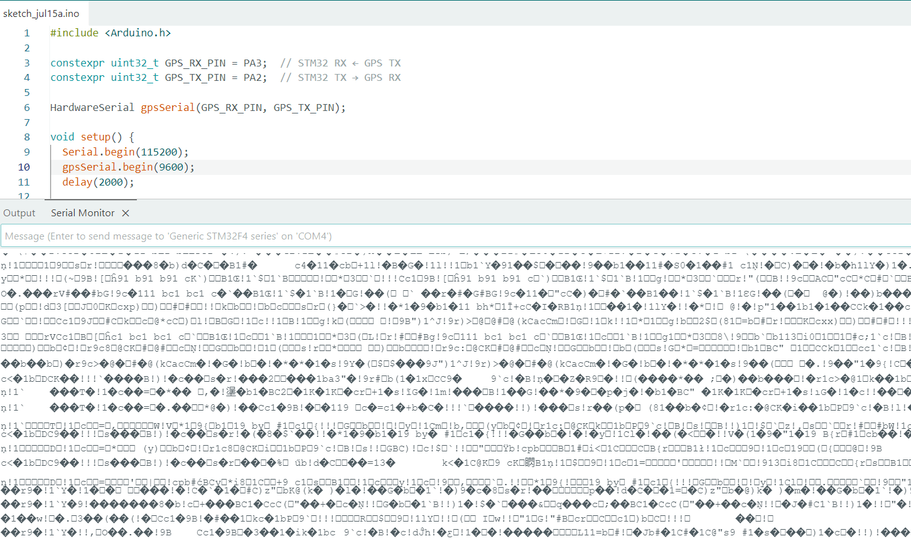
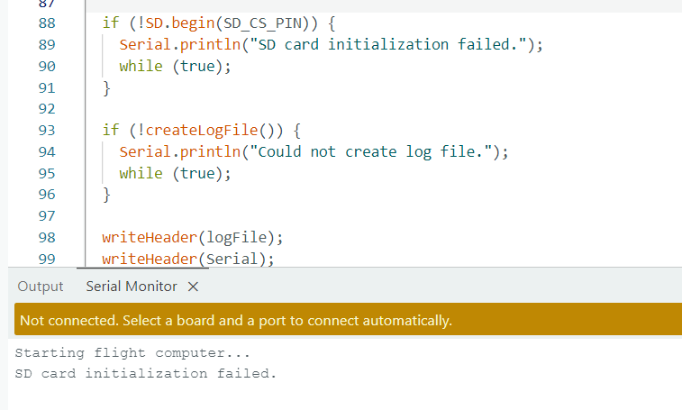

# Engineering Log

---
## June 15, 2026
### Problem
### Investigation
### Root Cause
### Solution
### Lesson Learned

---

## June 15, 2026

### Problem
The STM32 uploaded successfully, but the Serial Monitor showed no output.

### Investigation
- Checked the COM port.
- Tested the USB cable.
- Verified `Serial.begin(115200)`.
- Ran a simple Blink sketch.

### Root Cause
The USB serial connection was not configured correctly.

### Solution
- Bought a ST-Link
- Configured the correct USB serial interface and verified communication with a simple test program before reconnecting the sensors.

### Lesson Learned
Programming, debugging, and serial communication are separate subsystems. Can test them independently.

---

## June 26, 2026

### Problem
When testing the BNO085 orientation output (roll, pitch, and yaw), a 90° physical rotation sometimes resulted in an incorrect 180° change in the reported orientation.


### Investigation
- Verified the quaternion-to-Euler angle conversion equations.
- Printed the raw quaternion values to determine whether the problem originated from the sensor or from the conversion equations.
- Compared the quaternion output with the accelerometer output.

### Root Cause

- The BNO085 was functioning correctly. However, the code was reading the rotationVector data without first verifying that the current sensor event was actually a SH2_ROTATION_VECTOR event. As a result, accelerometer data was sometimes interpreted as quaternion data, producing invalid orientation values.

### Solution
Added event-type checking before reading each sensor report.

```cpp
if (bno08x.getSensorEvent(&sensorValue)) {

    if (sensorValue.sensorId == SH2_ROTATION_VECTOR) {
        ...
    }

}
```

---

## July 15, 2026

### Problem
GPS outputs random simbols rather than readable data.


### Investigation
- Verified TX/RX wiring between the GPS module and the STM32.
- Verified the STM32 UART pin assignments.
- Tested multiple UART baud rates (9600, 38400, 57600, and 115200).
- Confirmed that 115200 baud produced valid NMEA sentences.

### Root Cause
- The UART baud rate configured on the STM32 did not match the GPS module's UART baud rate. As a result, the STM32 sampled the incoming bits at incorrect times, producing corrupted characters.

### Solution
Configured the STM32 UART to use the same baud rate (115200 baud) as the GPS module.

```cpp
void setup() {
  Serial.begin(115200);
  gpsSerial.begin(115200);
  delay(2000);
}
void loop() {
  while (gpsSerial.available()) {
    Serial.write(gpsSerial.read());
  }
}
```
### Lesson Learned
- For UART communication, the receiver and transmitter need to have the same transimission rate in order for the data to be interpreted correctly.
- Some GPS modules output both human-readable NMEA messages and binary UBX messages. Binary data appears as random symbols in a serial terminal because it is intended for machine communication rather than human reading.

---
## July 17, 2026
### Problem
SD card initilaization failed


### Investigation
- Checked wiring and pin assignments.
- Possibly 128GB storage is too big. May want to try 8GB-32GB SDcards.
- SD card type could be wrong.
- Tried another SD card. Still did not work.

### Root Cause
### Solution
### Lesson Learned
