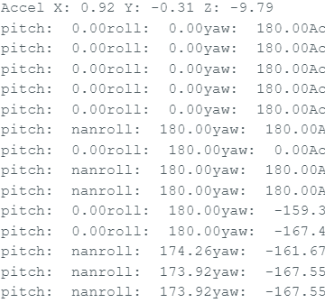

# Engineering Log

---

## June 15, 2026

### Problem
The STM32 uploaded successfully, but the Serial Monitor showed no output.

### Investigation
- Checked the COM port.
- Tested the USB cable.
- Verified `Serial.begin(115200)`.
- Ran a simple Blink sketch.

### Root Cause
The USB serial connection was not configured correctly.

### Solution
- Bought a ST-Link
- Configured the correct USB serial interface and verified communication with a simple test program before reconnecting the sensors.

### Lesson Learned
Programming, debugging, and serial communication are separate subsystems. Can test them independently.

---

## June 26, 2026

### Problem
When testing BNO085 position recognition (roll, pitch, yaw), the change in angle is inacurate. When turned 90 degrees, the serial output showed a 180 degrees change.

### Investigation
- 

### Root Cause

### Lesson Learned

### Solution
Configured the correct USB serial interface and verified communication with a simple test program before reconnecting the sensors.

### Lesson Learned
Programming, debugging, and serial communication are separate subsystems. Test them independently.
