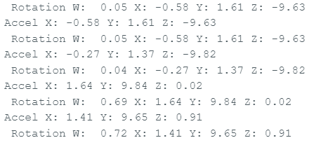

# Engineering Log

---

## June 15, 2026

### Problem
The STM32 uploaded successfully, but the Serial Monitor showed no output.

### Investigation
- Checked the COM port.
- Tested the USB cable.
- Verified `Serial.begin(115200)`.
- Ran a simple Blink sketch.

### Root Cause
The USB serial connection was not configured correctly.

### Solution
- Bought a ST-Link
- Configured the correct USB serial interface and verified communication with a simple test program before reconnecting the sensors.

### Lesson Learned
Programming, debugging, and serial communication are separate subsystems. Can test them independently.

---

## June 26, 2026

### Problem
When testing the BNO085 orientation output (roll, pitch, and yaw), a 90° physical rotation sometimes resulted in an incorrect 180° change in the reported orientation.


### Investigation
- Verified the quaternion-to-Euler angle conversion equations.
- Printed the raw quaternion values to determine whether the problem originated from the sensor or from the conversion equations.
- Compared the quaternion output with the accelerometer output.

### Root Cause

- The BNO085 was functioning correctly. However, the code was reading the rotationVector data without first verifying that the current sensor event was actually a SH2_ROTATION_VECTOR event. As a result, accelerometer data was sometimes interpreted as quaternion data, producing invalid orientation values.

### Solution
Added event-type checking before reading each sensor report.

```cpp
if (bno08x.getSensorEvent(&sensorValue)) {

    if (sensorValue.sensorId == SH2_ROTATION_VECTOR) {
        ...
    }

}
```
### Lesson Learned
- BNO085 uses an event-driven interface, so it first determines whether a new event has been received before processing it.
- Always check `sensorValue.sensorId` before reading the sensor data.
- Different sensor reports may have different output rates, so they should not be expected to arrive in a fixed order.
